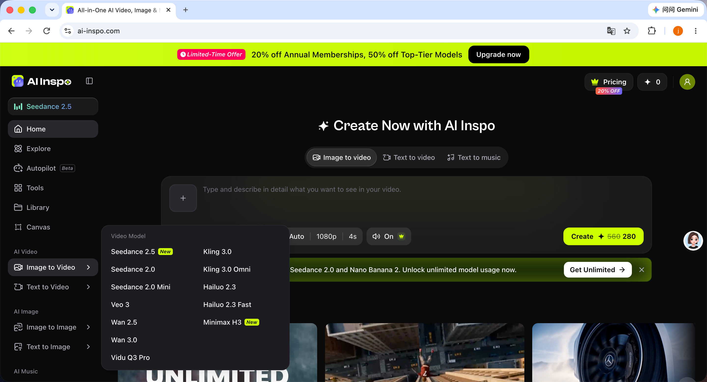
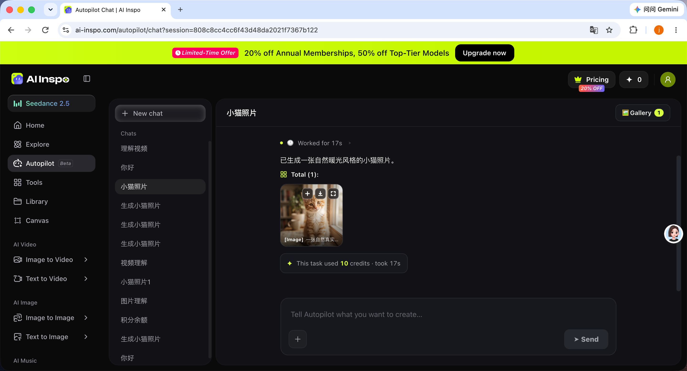
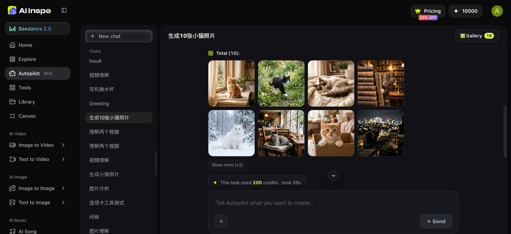
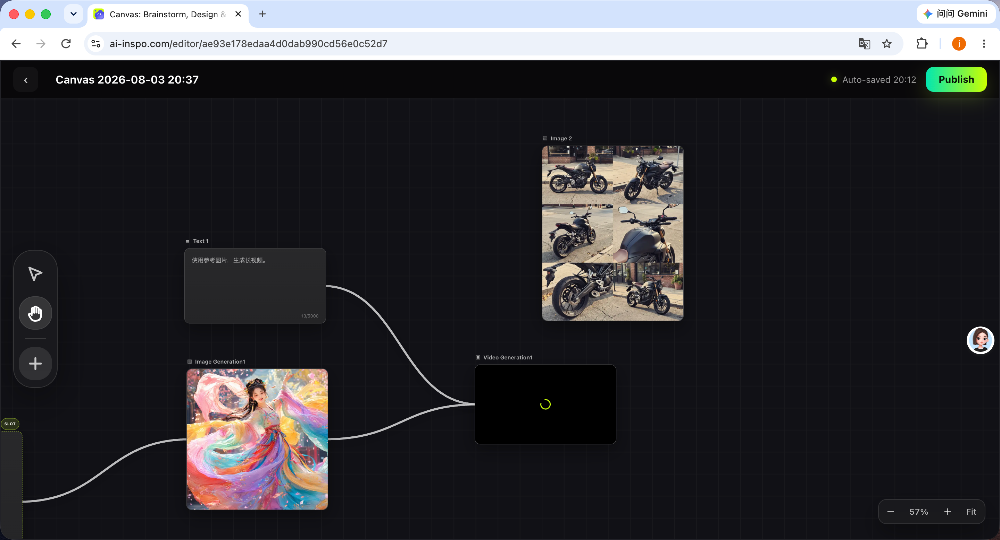
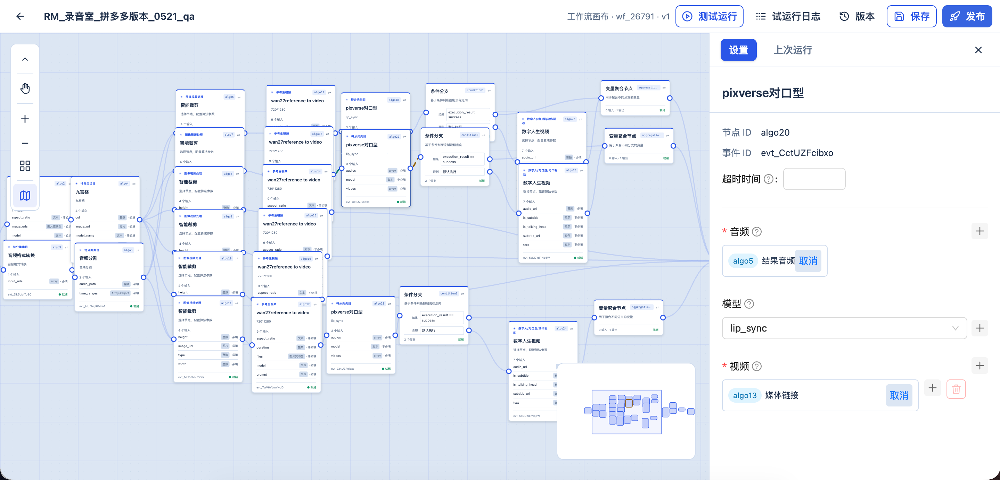
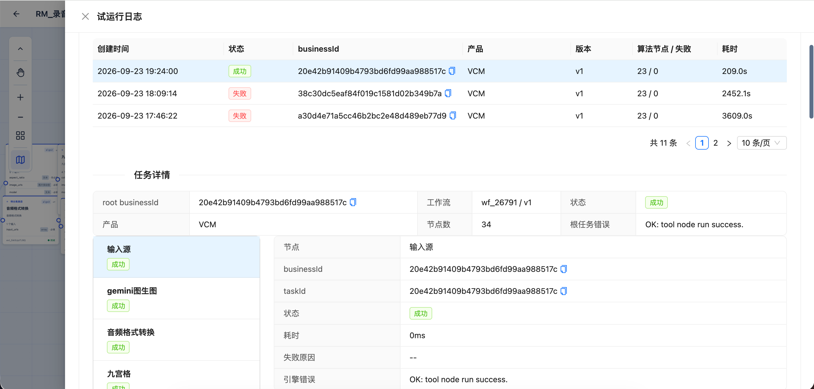

# 学习计划

自9月底从杭州小影科技离职后，观察整个就业市场，目前在杭州，音视频、渲染、nle开发几乎已经没有了。而且对于当前ai的发展来说，这部分确实也没有太多的技术壁垒和更高的价值。

其实对于agent开发来说，我也算是比较熟悉了（仅是平时工作岗位的title不叫：agent开发工程师而已）。

对于当前的就业市场，可能更多的是看：**过往的工作经历、是否从0-1上线过agent应用**等。但是对于我来说，这就比较尴尬。我做的agent开发不少，但是一部分是公司内部使用（奥创），还有一部分呢，也并未发布上线或是获得很好的用户反馈。

那对于用人单位来讲，就很难定位我的开发水平（面试也是需要成本的），所以，这段时间。我会从以下几个方向去**从0-1去开发（不使用vibe coding）**，即使这块的技术可能显的有些“古老/过时”。

1. **agent开发主线**（包含从api调用到上层框架使用，如：`langchain`、`langgraph`、`deepagents`、`dsh`、`codex sdk`等）；
2. **工作流的自部署、二次开发**（`dify`、`coze`、`comfy ui`等）；
3. **WebRTC的一些研究**（单纯的nle没有太多岗位需求了，结合硬件、WebRTC还行）；
4. **个人的兴趣方向**：`jev`在智能剪辑中的应用；
5. **算法**：模型微调、训练相关；

个人想找的工作也不局限上述三个方向，因为我的预估是：将来只会存在2类程序员。

1类是：**全栈工程师**（不局限开发、产品、运维、市场调研），还有1类只能被称为：**“文员”**了，也就是和`codex`、`cursor`、`dsh`这类coding agent对话的程序员了。

关于第4点，是因为笔者在最近面试中，遇到了一些公司在做智能剪辑过程中，想**节省llm的费用**。思来想去，`jev`在**快速决策**上来讲，确实也比较适合做这件事。故此计划将我的智能剪辑，接入`jev`，希望效果能丝滑一点。

## agent开发

对于这块，学习的主线是（出于成本考虑以`deepseek`的api为例）：

1. **api调用**，聊一聊llm对话底层协议；
2. **function-calling的使用**，agent工作的基础；
3. **上下文工程**：agent研发永远绕不过的坎；
4. **RAG**：知识图谱的使用；
5. **skills的加载流程**；
6. **subagent的实现**；
7. **langchain、langgraph的组合使用**：在agent中接入工作流；
8. **上层框架的使用**：`deepagents`篇；
9. **上层框架的使用**：`dsh`篇；
10. **上层框架的使用**：`codex sdk`篇；
11. **`langfuse`链路追踪与agent测评**；

### 相关项目展示

其中有些篇幅可能会很长，到时候分为：上、中、下篇去展示。

agent开发，按照我的理解，随着头部llm公司的角逐、陆续会开源更多优秀的、高集成的agent框架出来。可能就像llm应用一样，prompt工程师、skills工程师就慢慢消失了。那么将来agent开发可能也一样就消亡了。

**不管怎么样，我的学习经验是有价值的。**

## workflow工作流相关

其实我本人在小影也做了半个多月的工作流、无限画布开发。因为我本身就是做图形学出生，就单纯在前端渲染方面来说，还是比较有经验的（为什么说这个呢？因为最近刚面试了tapnow全栈开发，对于无限画布的性能优化，也聊了很久）。

回到正题：“工作流的开发”

相比较于agent开发来讲，工作流是**固定的执行流程**，比较适合不那么开放的场景，比如AIGC中的一些模板的表达、一些具体使用场景的sop是固定的。这时候使用工作流，也能一定程度上**减少badcase的发生率**。同时降低agent的使用成本与大模型的理解时间。

所以这块的章节应该是：

1. **本地搭建**：`dify`、`coze`、`comfy ui`；
2. **自定义节点的扩展**（前后端）；
3. **cli的使用**；

其实这块，第3点，框架都已经支持了，我只是做一个简单的使用与了解。

## WebRTC

这一块的学习计划，就不太可控了，基本上是围绕着即时聊天、直播去做吧。

## 算法

这块主要是模型微调、训练相关，章节规划：

1. **模型训练基础**；
2. **数据集的准备**；
3. **模型微调**：`LoRA`等；
4. **模型评估与部署**；

最后鼓励一下自己吧：**行藏在我，用舍由时。** 在日益加剧的竞争环境中，保持积极的学习心态与对市场的洞察吧。
