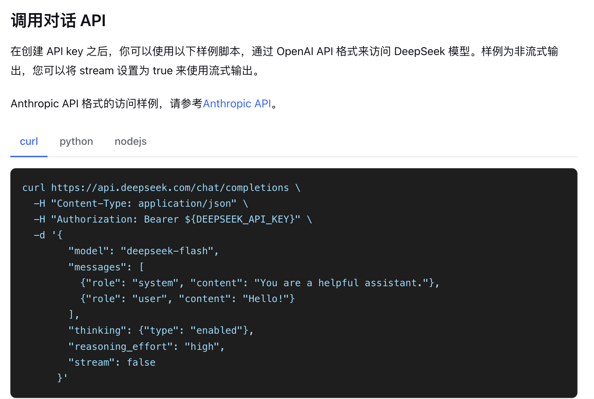
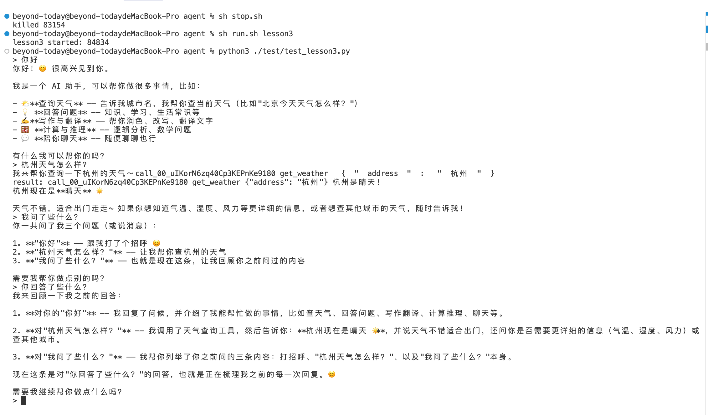

### 上下文工程1-流式agent对话

上下文工程这一章主要涉及到**流式输出**和**上下文的管理**。这一节先做一个最小的 agent，它要能：

- 调用工具；
- 流式输出；
- 简单 react；
- 临时上下文的管理；

### 流式输出协议格式

先来看看 deepseek 的流式输出调用：



请求里还有一些前面没用过的参数，例如：是否关闭思考、推理等级。把 `stream` 设为 `true` 之后，这里以提问「杭州的天气怎么样？」，拿到的是一串 chunk。

流式输出是 step-by-step 的，每次一个或几个 token。客户端看起来就是**打字机效果**，首token出现会比非流式快很多。

```json
{
  "id": "772281c9-56b1-4765-94b4-97f805e3067a",
  "object": "chat.completion.chunk",
  "created": 1791531311,
  "model": "deepseek-flash",
  "choices": [
    {
      "index": 0,
      "delta": {
        "role": "assistant",
        "content": null,
        "reasoning_content": ""
      },
      "finish_reason": null
    }
  ]
}
```

思考阶段，token落在 `reasoning_content`，content为空，如有思考展示需求需要特殊处理。

```json
{"content": null, "reasoning_content": "The"}
{"content": null, "reasoning_content": " user"}
{"content": null, "reasoning_content": " asks"}
{"content": null, "reasoning_content": " about"}
{"content": null, "reasoning_content": " today"}
{"content": null, "reasoning_content": "'s"}
{"content": null, "reasoning_content": " weather"}
{"content": null, "reasoning_content": " in"}
{"content": null, "reasoning_content": " Hang"}
{"content": null, "reasoning_content": "zhou"}
{"content": null, "reasoning_content": "."}
{"content": null, "reasoning_content": " I"}
{"content": null, "reasoning_content": " should"}
{"content": null, "reasoning_content": " call"}
{"content": null, "reasoning_content": " the"}
{"content": null, "reasoning_content": " weather"}
{"content": null, "reasoning_content": " tool"}
{"content": null, "reasoning_content": ".\n\n"}
{"content": null, "reasoning_content": "Wait"}
{"content": null, "reasoning_content": ","}
{"content": null, "reasoning_content": " the"}
{"content": null, "reasoning_content": " system"}
{"content": null, "reasoning_content": " prompt"}
{"content": null, "reasoning_content": " says"}
{"content": null, "reasoning_content": " I"}
{"content": null, "reasoning_content": " can"}
{"content": null, "reasoning_content": " invoke"}
{"content": null, "reasoning_content": " tools"}
{"content": null, "reasoning_content": "."}
{"content": null, "reasoning_content": " Let"}
{"content": null, "reasoning_content": " me"}
{"content": null, "reasoning_content": " call"}
{"content": null, "reasoning_content": " get"}
{"content": null, "reasoning_content": "_"}
{"content": null, "reasoning_content": "weather"}
{"content": null, "reasoning_content": " with"}
{"content": null, "reasoning_content": " address"}
{"content": null, "reasoning_content": " "}
{"content": null, "reasoning_content": "杭州"}
{"content": null, "reasoning_content": "."}
```

推理结束后开始吐工具。第一块带上 `id` 和函数名，参数是空的：

```json
{
  "choices": [
    {
      "index": 0,
      "delta": {
        "tool_calls": [
          {
            "index": 0,
            "id": "call_00_mE6AiuBEG3YwkCmN9Rur0420",
            "type": "function",
            "function": {
              "name": "get_weather",
              "arguments": ""
            }
          }
        ]
      },
      "finish_reason": null
    }
  ]
}
```

后面的块只有参数碎片，拼起来才是 `{"address": "杭州"}`：

```json
{"tool_calls": [{"index": 0, "function": {"arguments": "{"}}]}
{"tool_calls": [{"index": 0, "function": {"arguments": "\""}}]}
{"tool_calls": [{"index": 0, "function": {"arguments": "address"}}]}
{"tool_calls": [{"index": 0, "function": {"arguments": "\""}}]}
{"tool_calls": [{"index": 0, "function": {"arguments": ": "}}]}
{"tool_calls": [{"index": 0, "function": {"arguments": "\""}}]}
{"tool_calls": [{"index": 0, "function": {"arguments": "杭州"}}]}
{"tool_calls": [{"index": 0, "function": {"arguments": "\""}}]}
{"tool_calls": [{"index": 0, "function": {"arguments": "}"}}]}
```

最后一块停住，`finish_reason` 是 `tool_calls`：

```json
{
  "choices": [
    {
      "index": 0,
      "delta": {
        "content": "",
        "reasoning_content": null
      },
      "finish_reason": "tool_calls"
    }
  ],
  "usage": {
    "prompt_tokens": 306,
    "completion_tokens": 79,
    "total_tokens": 385,
    "completion_tokens_details": {
      "reasoning_tokens": 40
    }
  }
}
```

思考模式下，先走一轮思考：`choices -> delta -> reasoning_content`，这时 **content 是空的**。

推理完成后，模型判断要调用工具，就开始流式输出工具信息：函数名和参数。最后 **finish_reason 停在** `tool_calls`，等待工具调用。

### agent-loop实现

这里的实现和之前的非流式递归解析工具类似。我们需要一个循环，在每轮对话完成后调用对应的工具。

```python
def event_stream(messages):
    response = requests.post(
        f"{base_url}/chat/completions",
        headers={"Authorization": f"Bearer {api_key}"},
        json={"model": model_name, "messages": messages, "tools": TOOLS, "stream": True},
        stream=True,
        timeout=120,
    )
    response.raise_for_status()
    try:
        for line in response.iter_lines():
            if not line:
                continue
            text = line.decode()
            if not text.startswith("data: "):
                continue
            data = text[6:]
            if data == "[DONE]":
                break
            yield json.loads(data)
    finally:
        response.close()


@app.post("/stream_chat")
def stream_chat(body: MessageIn):
    messages = context_list[body.context_id]["messages"]
    messages.append({"role": "user", "content": body.message})

    def generate():
        # 循环调用流式事件，有工具执行
        while True:
            # 单次调用的工具调用、推理内容、消息内容
            function_calls = []
            reasoning_content = ""
            message_content = ""
            for chunk in event_stream(messages):
                for choice in chunk["choices"]:
                    tool_calls = choice["delta"].get("tool_calls", [])
                    reasoning_content += choice["delta"].get("reasoning_content") or ""
                    message_content += choice["delta"].get("content") or ""
                    for tool_call in tool_calls:
                        if "id" in tool_call:
                            function_calls.append({
                                "id": tool_call["id"],
                                "name": "",
                                "arguments": ""
                            })
                        if "function" in tool_call:
                            function_calls[-1]["name"] += tool_call["function"].get("name") or ""
                            function_calls[-1]["arguments"] += tool_call["function"].get("arguments") or ""
                yield f"data: {json.dumps(chunk, ensure_ascii=False)}\n\n"
            # 如果没有工具需要执行，则sse结束
            if not function_calls:
                if message_content:
                    messages.append({"role": "assistant", "content": message_content})
                break
            # 工具消息组装进上下文
            messages.append({
                "role": "assistant",
                "content": "",
                "reasoning_content": reasoning_content,
                "tool_calls": [
                    {
                        "id": call["id"],
                        "type": "function",
                        "function": {"name": call["name"], "arguments": call["arguments"]},
                    }
                    for call in function_calls
                ],
            })
            # 工具执行结果组装进上下文
            for function_call in function_calls:
                content = "工具调用失败" if function_call["name"] != "get_weather" else get_weather(json.loads(function_call["arguments"]).get("address", ""))
                messages.append({
                    "role": "tool",
                    "tool_call_id": function_call["id"],
                    "content": content,
                })
                yield_data = {
                    "choices": [{
                        "delta": {
                            "tool_calls": [{
                                "id": function_call["id"],
                                "type": "function_result",
                                "function": {"name": function_call["name"], "arguments": function_call["arguments"]},
                                "content": content,
                            }]
                        }
                    }]}
                yield f"data: {json.dumps(yield_data, ensure_ascii=False)}\n\n"
        # 单次调用的结束，进入下一轮推理

    return StreamingResponse(generate(), media_type="text/event-stream")
```

这里的 `while` 循环，实际上就是 agent 的 react 过程：**思考 -> 调用工具 -> 拿到结果 -> 继续思考**。

我们这里维护了一个简单的对话列表，没有持久化，只在内存里。包含基本的创建、销毁、查询。每轮消息完成后，把完整的消息再添加进上下文的 `messages`：llm 回复、工具调用、工具结果。

这一轮 **不需要调用工具**，对话就结束了。**有工具调用**，就把工具调用和执行结果装进消息上下文，继续推理。

### 流式输出测试

到这里，整个 react-agent 已经基本完成了。缺少的上下文压缩，放到下一章。

现在要解析 SSE，测试连续对话。思考过程先不打印，只输出 `content`，再加上工具调用和执行结果：

```python
def stream_chat(context_id, message):
    data = json.dumps({"context_id": context_id, "message": message}).encode()
    req = urllib.request.Request(
        base + "/stream_chat",
        data=data,
        headers={"Content-Type": "application/json"},
        method="POST",
    )
    with urllib.request.urlopen(req) as resp:
        for raw in resp:
            line = raw.decode().strip()
            if not line.startswith("data: "):
                continue
            chunk = json.loads(line[6:])
            for choice in chunk["choices"]:
                content = (choice.get("delta") or {}).get("content")
                if content:
                    print(content, end="", flush=True)
                # 输出工具调用
                tool_calls = choice.get("delta", {}).get("tool_calls", [])
                for tool_call in tool_calls:
                    tool_call_type = tool_call.get("type", "")
                    if tool_call_type == "function_result":
                        print("\nresult:", tool_call["id"], tool_call["function"]["name"], tool_call["function"]["arguments"], tool_call["content"])
                    else:
                        print(tool_call.get("id", ""), tool_call["function"].get("name", ""), tool_call["function"].get("arguments", ""), end="", flush=True)
    print()
```

测试一下输出：



这时 agent 已经有了**上下文记忆**、**工具调用**，以及执行完成后继续 react。
再下一章节，我们将会加上上下文压缩的相关内容，避免大模型超出上下文的限制。

仓库地址：[https://github.com/qingpingwang/learn](https://github.com/qingpingwang/learn)

交流群（QQ）：[图形/渲染/音视频/AI应用交流群](https://qm.qq.com/q/2d9YzGPNmQ)（523219063）