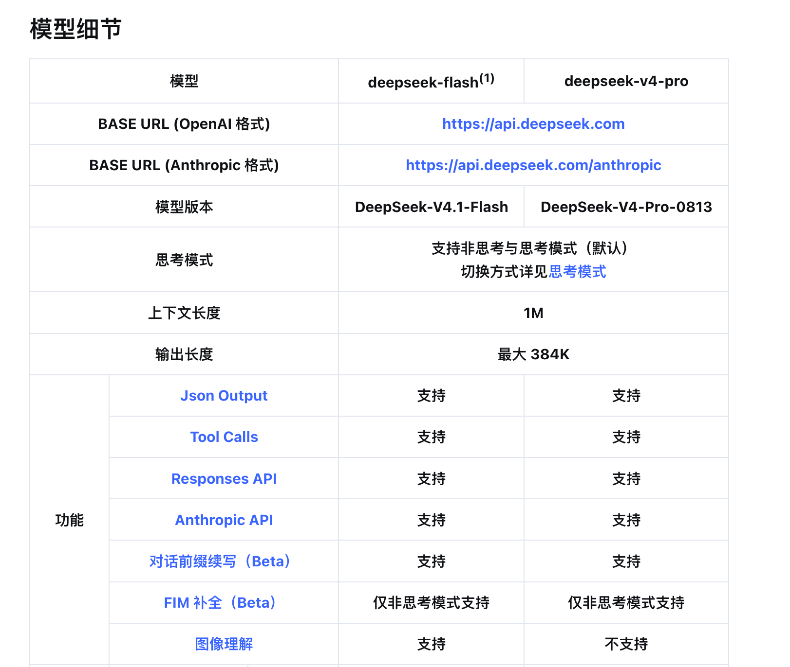
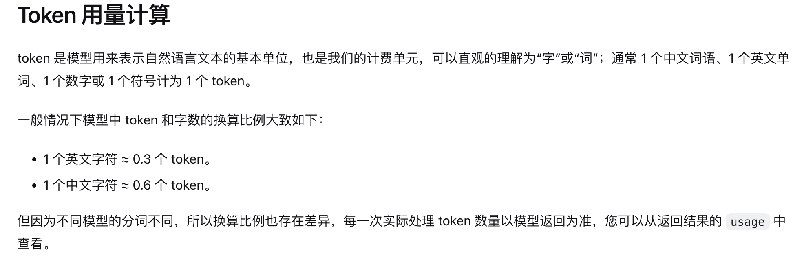
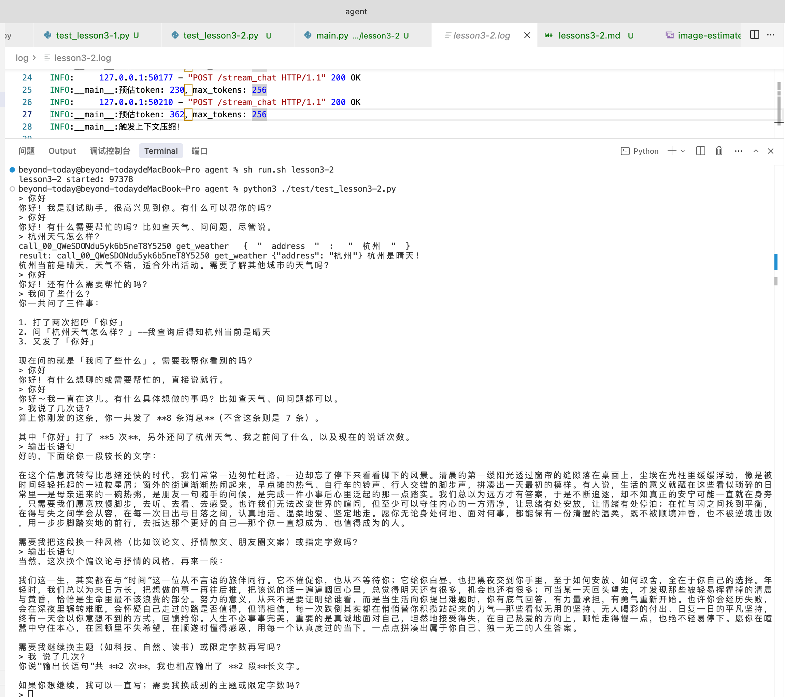
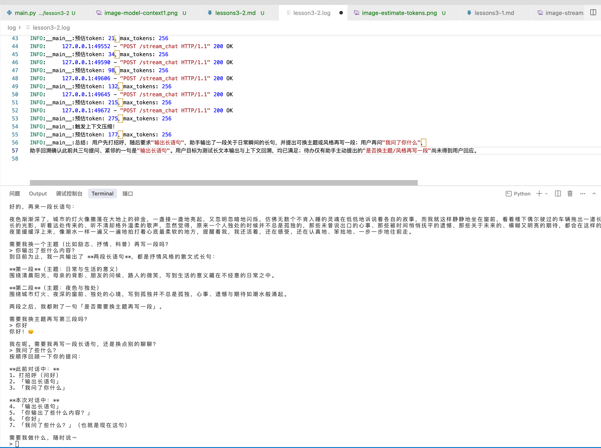

### 上下文工程2-上下文管理

这一章，主要针对大模型现阶段的主要限制：**上下文溢出**，做个简单处理。大模型在调用的时候，上下文的大小是有限制的，以 DeepSeek 为例：



上下文的限制在 1M。这里即便上下文已经很大了，上下文的管理依旧很重要。这里主要存在两个问题：

1. 过多的上下文导致模型调用成本越来越高、思考越来越慢。犹如在泥地里走路，越走鞋越重，需要定时裁剪上下文；
2. 当提问时，如果上下文中无关的内容太多，会削弱 llm 的注意力，导致回答的结果不理想；

这一块可以说是 agent 研发的核心，后续的 RAG、上下文压缩，本质上都还是在做上下文工程的管理。假如某一天，llm 不再限制上下文的用量，以及注意力机制能够被完美解决，那么 agent 开发这个岗位就可以消失了。本质上这些工作都还是在补齐 llm 的短板。

比如现在很多公司开发的内部 agent，可能已经不需要上下文管理了。高智商的大模型在注意力上也做得越来越好。1M 的上下文也足够业务场景聊上半天了。加上一个简单的上下文压缩、截断就 ok 了。要知道《西游记》78.5 万字才不到 0.5M Token 左右（每个 llm 底层计算方式不一致，以deepseek为例：**1 个中文字符 ≈ 0.6 token** 是 **DeepSeek / Qwen 这类中文优化分词器** 的官方估算口径）。

### 中间件-hook机制

像 langchain 这样的框架，都是使用**中间件**，允许开发者集成自己的：日志、观测，以及动态注入修改上下文、动态提示词、模型切换的功能。

我们这里参考 langchain 的实现，完成动态提示词 + 上下文管理。

```python
def completion_body(messages, stream=False):
    system_prompt = dynamic_system_prompt(SYSTEM_PROMPT)
    # 调用中间件
    for middleware in middleware_list:
        middleware(messages, system_prompt)
    body = {
        "model": model_name,
        "messages": [{"role": "system", "content": system_prompt}, *messages],
        "tools": TOOLS,
    }
    if stream:
        body["stream"] = True
    return body
```

这里 `middleware_list` 是一个数组，入参支持：上下文 + 系统提示词。用户可预估 token，我们以 DeepSeek 的预估为例：



我们的 Token 预估对齐 langchain（本身预估 Token 也只是一个参考指标，真实的 token 消耗从模型返回就能拿到）：

```python
# 对齐 langchain_core.messages.utils.count_tokens_approximately
# 英文大约 4 个字符一个 token，每条消息再加 3 个角色标记
def estimate_tokens(messages, chars_per_token=4, extra_tokens_per_message=3):
    total = 0
    for message in messages:
        chars = 0
        content = message.get("content")
        if isinstance(content, str):
            chars += len(content)
        elif content is not None:
            chars += len(json.dumps(content, ensure_ascii=False))
        if message.get("tool_calls"):
            chars += len(json.dumps(message["tool_calls"], ensure_ascii=False))
        if message.get("reasoning_content"):
            chars += len(message["reasoning_content"])
        if message.get("name"):
            chars += len(message["name"])
        total += math.ceil(chars / chars_per_token) + extra_tokens_per_message
    return total
```

这里，我们简单测试两种方式的上下文压缩：

1. 超过 token 阈值则截断，保留仅 20 条消息（数量可以调整）；
2. 超过 token 阈值，调用大模型生成上下文关键信息总结 + 近 10 条消息；

方法 2 的话，会多调用一次大模型，但是好处是：保留了上下文的关键信息，不至于让 agent 像断了片一样。另外业界的很多复杂做法，如将上下文写入本地，支持向量检索，再需要时加入上下文（这个对我们来说就太复杂了，我们就点到为止吧）。

这里的压缩，还有一点比较麻烦的是：我们需要保证消息的完整性，tools-call、tools-result 成对，不然就会出现大模型调用出错的情况。

相关代码如下：

```python
def align_tool_messages(full, truncated):
    # 1.过滤出完整的工具调用消息
    message_call = {}
    for message in full:
        if message.get("role") != "assistant":
            continue
        # 多个工具调用，一次下发的情况，需要记录下所有工具调用id
        for call in message.get("tool_calls") or []:
            # 函数调用判断
            if call.get("type") != "function":
                continue
            message_call[call["id"]] = message

    # 2.截断列表里已经配上的调用记下来，剩下的 tool 结果才是没闭合的
    function_call_ids = []
    orphan_ids = []
    for message in truncated:
        if message.get("type") == "tool_call":
            for call in message.get("tool_calls") or []:
                function_call_ids.append(call["id"])
            continue
        call_id = message.get("tool_call_id")
        if message.get("role") == "tool" and call_id not in function_call_ids:
            orphan_ids.append(call_id)

    # 非闭合工具，把整条 tool_call 消息插到开头，考虑一次下发多次工具消息的情况，通过inserted过滤
    inserted = []
    # 3.倒序遍历，因为工具调用结果是按顺序下发的，所以需要倒序遍历
    for call_id in reversed(orphan_ids):
        message = message_call.get(call_id)
        if message is None or message in inserted:
            continue
        truncated.insert(0, message)
        inserted.append(message)
```

1. 先拿到原始的全部工具调用，以完整的 `tool_call_id -> message` 存储；
2. 找到截断后的消息里未闭合的 tools 调用（只有执行，没有调用）；
3. 倒序插入对应的 message（考虑到一次消息下发多个 tools 调用的情况，需要使用 inserted 做一下过滤）；

#### 上下文压缩-截断上下文

截断上下文是最早期比较简单的办法，丢掉最早的上下文信息，保留最近的 N 条信息：

```python
# 压缩上下文
def compress_context(messages, system_prompt: str):
    # 预估token
    tokens = estimate_tokens([{"role": "system", "content": system_prompt}, *messages])
    if tokens < max_tokens:
        return
    full = list(messages)
    del messages[:-5]
    align_tool_messages(full, messages)
```

测试结果（我们调小 max_tokens 去测试）：



可以看到，在触发上下文压缩后，agent 再次提问，已经丢失了之前的对话内容了。

#### 上下文压缩-关键信息保留

在这一轮优化中，我们把之前的生硬截断 + 补齐 tool_call 的方案做一个优化：找到合理的截断位置，向上找到最后一个非工具调用：

```python
def cutoff_index(messages, keep):
    # 保留最后 keep 条，切口不能落在 tool 结果上，要退到这组 tool_call 的开头
    if len(messages) <= keep:
        return 0
    cutoff = len(messages) - keep
    while cutoff > 0 and messages[cutoff].get("role") == "tool":
        cutoff -= 1
    return cutoff
```

保留最后 3 条时，倒数第 3 条如果是工具结果，会一直往前退，直到退到 tool_call：

```text
0 user                 ← 拿去总结
1 user                 ← 拿去总结
2 assistant tool_call  ← cutoff 停在这里，从这条开始留下
3 tool
4 tool
5 user
```

生成 summary 的代码如下（调用大模型生成，summary_prompt 需要根据不同的业务场景去针对性的优化）：

```python
def summary_context(messages):
    # 调用大模型总结。单独组一份消息，避免压缩中间件改到原来的上下文
    summary_prompt = "把下面的对话压缩成一段简短摘要，保留用户目标、已确认的事实和未完成事项。只输出摘要。"
    response = post_completions(
        [{"role": "user", "content": f"{summary_prompt}\n{json.dumps(messages, ensure_ascii=False)}"}],
        stream=False,
    ).json()
    return response["choices"][0]["message"].get("content") or ""
```

最后触发上下文压缩的输出：



可以看到：此时 agent 在上下文压缩后，由于将总结信息注入了上下文，仍然记得和用户聊天的关键信息。

### 动态系统提示词

在很多场景下，我们需要对系统提示词做修改，比如：注入事件、角色信息。我们在最终发送给大模型消息前调用一次修改函数：

```python
def dynamic_system_prompt(system_prompt: str) -> str:
    return f"{system_prompt}当前的系统时间是：{datetime.now().strftime('%Y-%m-%d %H:%M:%S')}。"
system_prompt = dynamic_system_prompt(SYSTEM_PROMPT)
```

我们这里注入了时间，当我们对时间进行提问时，大模型便能知道当前的系统时间。在 agent 的应用中，skills 的动态加载，最终也就是对应到系统提示词的动态拼接。

在下一章节中，我们将继续上下文组织的另一部分：RAG。总的来说，都还是属于上下文工程，只是在有限的上下文中，怎么更高效、更准确地检索到我们需要的信息。

仓库地址：[https://github.com/qingpingwang/learn](https://github.com/qingpingwang/learn)

交流群（QQ）：[图形/渲染/音视频/AI应用交流群](https://qm.qq.com/q/2d9YzGPNmQ)（523219063）